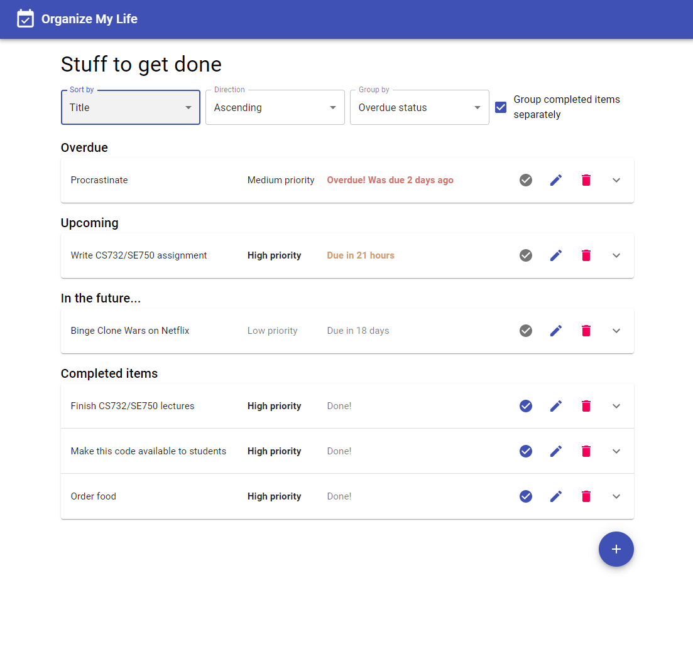

# Personal Schedules Manager Application

This React-based application can help people to efficiently manage their own schedules, as well as group display and sort by different attributes.

## What is it built on

The backend is built using React, Express, and MongoDB.
The frontend is built using React, Redux, and Material UI.

## How do you run it locally

### Backend

For Database, [MongoDB community server](https://www.mongodb.com/download-center/community), and (optionally) [Compass](https://www.mongodb.com/products/compass)

- If you'd rather use an [Atlas cloud MongoDB instance](https://www.mongodb.com/cloud/atlas) instead of installing community server on your dev machine, you're welcome to do so. In this case, remember to appropriately modify `server/server.js` to change the connection string.

In the 'server' directory, you need to run:

```
npm install
npm start
```

Afrer that, open a new browser to run

<http://localhost:10000/api/init>

### Frontend

In the 'client' directory, you also need to run:

```
npm install
npm start
```

Afrer that, open a new browser to run

<http://localhost:3000/>

When complete, the app will look similar to that shown in the following screenshot:


